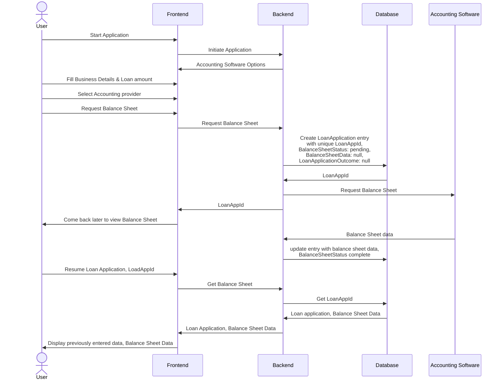

# Introduction
This is a FastAPI application. There are several endpoints to facilitate a loan application.

# Installation and Running
## Installing on your local machine
It is recommended to create a virtual environment to isolate the dependencies for this application and avoid conflicts with other projects in your machine

### Windows
```
python -m virtualenv venv
venv/Scripts/activate
```

### Linux
```
python3 -m virtualenv venv
venv/bin/activate
```

### Windows/Linux
`pip install -r requirements.txt`

### Run
``` 
python run.py -h 0.0.0.0 -p 8080
python3 run.py -h 0.0.0.0 -p 8080 
```

FastAPI provides a swagger UI for ease of testing. It will be available at `https://localhost:8080/docs`

## Docker
A dockerfile is also available should you want to run this application in a container.
```
docker build -t loan-application .
docker run -p 8080:8080 loan-application -H 0.0.0.0 -p 8080
```

# Project Structure

Source code resides within the app folder, which has the following structure
```
app
|--api
   |--routes
   |--schemas
|--services
   |--preassessment
|--adapters
   |--accounting_software
   |--decision_engine
|--common
   |--enums
main.py
tests
|--services
```

### **main.py**
Here endpoints are registered to the application, configure CORS and add custom exception handlers

### **api**
- The routes module contains the different controllers
- The schemas module contains the models for the requests and response models of the endpoints. Each model can be validated by its own set of rules

### **services**
- The services module contains the business logic needed for the application.
- Rules, Rule Engine and Strategies are implemented in the preassessment module

### **adapters**
- Adapters to external services are implemented here. DTOs specific to each adapter is also kept in this module.

### **common**
- miscellaneous items are kept in this module.
    - enums for names of accounting services.

# Extensibility
This application was built with extensibility in mind. More accounting software can be onboarded with minimal changes to the existing code. Similarly
addtional rules and strategies can be added.

To add the above, additional entries have to be made in the `config.yml` file, followed implementations in the respective modules.

# Onboarding new accounting software
- Add a new entry to the `accounting-software` section of the config file
- Implement a concrete version of the `AbstractAccountingAdapter`
    - The concrete class must minimally implement the `fetch_balance_sheet` and `normalize_balance_sheet` methods
- The AccountingAdapterFactory will read config file and inject all implemented accounting software adapters into the application.

# Rule Engine
The Rule Engine will evaluate the loan application. The details of the loan application is passed to each Rule, each of which will return a boolean flag (to signify if the application has passed the rule check) and a pre-assessment value.

The Rule Engine will then apply a Strategy to select a single pre-assessment value from all that passed the rule checks. A final number is  returned as the pre-assessment value.

## Adding new Rules and Strategies
Similar to onboarding new accounting software, there are abstract classes and factories for rules and strategies. The application will read them from the configuration file and inject the implementations.

# Future improvements
## Asynchronous communication between backend and Accounting Software/Decision Engine services
Currently, the application assumes that the communication to the Decision Engine and Accounting Software services is synchronous. 

If this is not the case, store the loan application, respond with a LoanAppId,  while waiting for the Accounting Software or Decision Engine



A similar process can be applied to communication with the Decision Engine too.

## Security Improvements
### SQL Injection
When introducing a database, we also introduce new vulnerabilities such as SQL injection attacks. The inputs from the user are not scrubbed.

Instead of scrubbing each input, we can use an ORM to parametrize our queries and avoid using raw SQL. This will avoid any SQL injection attempts, and also help with the maintainability of the code.

### Industrial standards web security
We can also include the following which are industry standards
- HTTPS
- CORS
   - The current implementation does have CORS, but it permits all origins. Instead, we should build a whitelist
- Authentication and Authorization
   - If we want users to be able to save and continue their loan applications later, while not allowing them to view other loan applications, we will have to separate the loan applications by users
   - After a user logs in, issue a JSON web token which we can use to verify their identity
   - Integrate with Identity Providers like Google so we don't have to build our own user database

- Logging of application events and errors